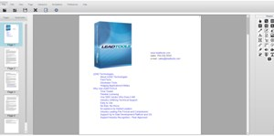

# Document Viewer Demo

## Summary

Demonstrates using the LEADTOOLS Document Viewer SDK with HTML5 / JavaScript.

* Load a document from local disk or a url
* Draw annotations on the document
* Use thumbnail viewer
* Interactive zooming/panning

## Building/running with Node.js/npm (all platforms)

### First time setup

1. Ensure you have NodeJS installed: [https://nodejs.org/](https://nodejs.org/)
2. From the command line, install the development dependencies with `npm install`

### Building

Simply execute `npm run build` from the command line

Note: This will build the ts directory into site, as well as updating the common scripts and resources.

### Running

Execute `npm run start` from the command line.

Note: This should open your default browser to the hosted site.

## Building/running with Visual Studio (Windows only)

Simply open the SLN file in this directory to get started.

Note: If you do not have TypeScript installed, or wish to develop exclusively using JavaScript, you can simply open the CSPROJ within the site directory.

## Back-end service

1. Launch one of the DocumentService___ projects found within ../../Services
2. Ensure ./site/serviceConfig.json is properly configured
